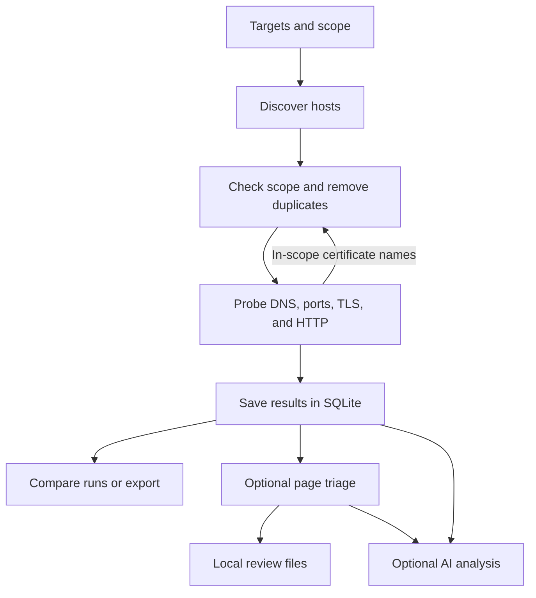

# recon_test 🚀

`recon_test` is a Rust command-line tool for mapping the web attack surface of domains or IPs you are authorized to test. It discovers in-scope hosts, checks DNS and web services, and saves scan history in SQLite. You can compare runs or create a small local review queue with optional triage.

## Quick start

Install Rust and Cargo, then build the project:

```bash
git clone https://github.com/sssec81/recon_test.git
cd recon_test
cargo build --release
```

Run a first scan without the optional crt.sh lookup:

```bash
cargo run --release -- --target example.com --scope example.com --passive false
```

Results go to `recon_data.db` in the current directory. Use `--db` to choose another path. Only scan hosts you have permission to test.

## How a scan works



Host discovery uses your targets and, by default, certificate records from crt.sh. The scanner probes ports `80`, `443`, `8000`, `8080`, and `8443`. Target HTTP redirects are followed manually only when every hop remains in scope; each hop is separately rate-limited and budgeted. crt.sh uses bounded retries. If it remains unavailable, the scan continues and records a failed provider status, so passive hostname discovery may be incomplete.

A domain scope includes that domain and its subdomains. An IP scope includes only that IP. With `--file`, set `--scope` to the authorized root domain if you want discoveries across that root; otherwise each file entry becomes a scope root.

Choose a web probe mode with `--scheme-strategy`:

- `https-first` (default): try HTTPS, then HTTP if HTTPS fails. When web ports are detected, probe each detected endpoint.
- `https-only`: skip plain HTTP.
- `both-parallel`: try both schemes together when no web port is detected; also try both on alternate web ports.

The scanner tries the selected scheme even if the port check missed it. Failed web requests are saved without a status code.

## Code layout

| Path | Purpose |
| --- | --- |
| `src/main.rs`, `src/cli.rs` | Start the CLI and read targets |
| `src/scan/`, `src/probes/` | Enforce scope, schedule work, and probe hosts |
| `src/storage/` | Save observations in SQLite |
| `src/report/` | Compare scans, export data, and request optional AI analysis |
| `src/triage/` | Crawl pages and build local review files |

## CLI Options & Usage Examples

| Flag | Description | Default |
| --- | --- | --- |
| `-t, --target <TARGET>` | Single target domain or IP (required unless `--file` is used) | None |
| `-s, --scope <SCOPE>...` | Authorized root scope domain(s) | Target input domain |
| `-f, --file <PATH>` | File containing target subdomains (one per line) | None |
| `-c, --concurrency <N>` | Maximum concurrent scan tasks | `20` |
| `--max-targets <N>` | Maximum distinct hosts scheduled; the scan fails if discovery exceeds this limit | `10000` |
| `--passive [true\|false]` | Ingest passive Certificate Transparency logs via crt.sh | `true` |
| `--scheme-strategy <STRATEGY>` | Probing scheme (`https-first`, `https-only`, `both-parallel`) | `https-first` |
| `--diff-last` | Diff against the previous compatible finished run | `false` |
| `--diff <UUID_A> <UUID_B>` | Compare specific historical scan runs | None |
| `--ai-analyze` | Run optional Phase 6 analysis after deterministic review (`--llm-analyze` remains an alias) | `false` |
| `--ollama-model <MODEL>` | Local Ollama model name | `llama3:8b` |
| `--ollama-url <URL>` | Local Ollama API endpoint | `http://localhost:11434` |
| `--llm-backend <BACKEND>` | AI backend (`ollama` or `anthropic`) | `ollama` |
| `--anthropic-api-key <KEY>` | Anthropic API key (or use `ANTHROPIC_API_KEY`) | None |
| `--anthropic-model <MODEL>` | Anthropic model name | `claude-3-5-haiku-20241022` |
| `--llm-max-tokens <N>` | Maximum AI response tokens | `1024` |
| `--ai-max-candidates <N>` | Maximum ranked candidates supplied to Phase 6 (hard-capped at 10) | `10` |
| `--ai-max-related-endpoints <N>` | Maximum related endpoint summaries (hard-capped at 40) | `40` |
| `--ai-max-requests <N>` | Maximum bounded provider attempts | `2` |
| `--ai-max-input-bytes <N>` | Maximum sanitized provider input size | `65536` |
| `--ai-max-output-bytes <N>` | Maximum accepted structured response size | `65536` |
| `--ai-timeout-seconds <N>` | Provider request timeout | `120` |
| `--ai-retries <N>` | Bounded provider retry count | `1` |
| `--triage` | Run bounded evidence triage after recon | `false` |
| `--triage-max-pages <N>` | Maximum pages or scripts fetched in triage | `250` |
| `--triage-max-depth <N>` | Maximum crawl depth from discovered endpoints | `2` |
| `--triage-max-requests <N>` | Triage crawl and verification request budget, including checks; also contributes to the shared target-HTTP ceiling | `1000` |
| `--triage-max-minutes <N>` | Triage phase time limit in minutes | `240` |
| `--triage-max-findings <N>` | Maximum review queue entries | `5` |
| `--triage-delay-ms <N>` | Delay between triage requests | `200` |
| `--triage-dir <PATH>` | Local review and evidence directory | `triage_output` |
| `--controlled-verification` | Run Phase 3 controlled verification against confirmed-live inventory | `false` |
| `--verification-max-opportunities <N>` | Maximum Phase 3 opportunities actively checked | `10` |
| `--verification-requests-per-opportunity <N>` | Phase 3 request limit per opportunity; hard-capped at two | `2` |
| `--review-max-candidates <N>` | Maximum Phase 4 candidates shown and exported | `10` |
| `--review-min-score <0-100>` | Minimum investigation-priority score for the primary queue | `20` |
| `--export-json <PATH>` | Export scan observations to JSON file | None |
| `--export-csv <PATH>` | Export scan observations to CSV file | None |
| `--export-diff-json <PATH>` | Export scan diff results to JSON file | None |
| `--db <PATH>` | SQLite database file | `recon_data.db` |

`--target` takes precedence if both `--target` and `--file` are supplied. `--diff` still performs a new scan before comparing the two requested historical IDs. JSON and CSV exports contain this run's HTTP observations; they are not complete exports of every database table.

### Scan single target with active scope and passive CT logs:
```bash
cargo run -- -t example.com --scope example.com --passive true
```

### Run optional constrained AI analysis with Ollama:
```bash
cargo run -- -t example.com --scope example.com --ai-analyze
```

For Anthropic analysis, set `ANTHROPIC_API_KEY` and add `--llm-backend anthropic`.

### Build a local review queue

```bash
cargo run --release -- -t example.com --scope example.com --passive false --triage
```

Triage starts after recon. It follows in-scope GET links and scripts, skips common state-changing paths, and does not submit forms. Triage retains its own `--triage-max-requests` crawl/verification limit. In addition, reconnaissance, triage, and verification share a target-HTTP scheduler with scope checks, global and per-host pacing, concurrency limits, deadlines, and a total ceiling of `max-targets × 8 + triage-max-requests` requests. Output is saved under `triage_output/<scan-id>/review.md`, `review.json`, `endpoints.json`, `anomalies.json`, `suppressed.json`, and `evidence/`. The endpoint inventory records route templates, query and form field names, discovery sources, observed statuses, and content types. `suppressed.json` records candidates rejected by repeat or control checks, budget limits, and the review queue cap. Review packages contain response metadata, a short text excerpt, and a body hash. They do not contain full response bodies. Treat local evidence as potentially sensitive.

Deep discovery now completes before deterministic classification and controlled verification. Triage links, JavaScript/source-map discoveries, form methods, parameter locations, and actually fetched responses feed the scan-scoped SQLite inventory in the same run. Triage fetches use the same response-fingerprint implementation as initial probes and count as confirmed-live evidence only when a complete active response was retained. The shared scheduler remains the sole owner of redirect following and request accounting.

Triage also rechecks initial web endpoints that returned a server error, so a detailed error page at the scan entry point can enter the review queue.

### Run controlled verification

```bash
cargo run --release -- -t example.com --scope example.com --controlled-verification
```

Phase 3 deterministically narrows endpoint classifications, parameter semantics, fingerprints, and provenance into investigation opportunities. Only confirmed-live, complete GET baselines are eligible. An eligible opportunity receives one repeat and, for redirect/search semantics, at most one same-origin inert control. Every request uses the shared scheduler and its scope, redirect, pacing, concurrency, deadline, and request-budget controls. Results and suppression reasons are stored in `investigation_opportunities` and `verification_attempts`; console output explicitly remains a manual-review candidate and does not create vulnerability findings. Request URLs have values redacted, and persisted fingerprints redact redirect targets.

Phase 7 is a pipeline and evidence repair, not a new payload engine. It adds no aggressive vulnerability payloads, form submission, arbitrary non-GET execution, identifier enumeration, or automatic vulnerability confirmation.

### Deterministic candidate ranking

Phase 4 runs after local evidence collection whether or not controlled verification is enabled. It makes zero network or AI requests. The phase groups classifications, parameter semantics, provenance, fingerprints, Phase 3 opportunities, and conservative same-scope history by canonical endpoint, then writes the top deterministic review queue to `triage_output/investigation_candidates.json`.

The default queue contains at most 10 unsuppressed candidates scoring at least 20. The 0–100 score means only “inspect this sooner”; it is not vulnerability severity or confirmation. Every point is exported with a named explanation, lower-ranked and suppressed candidates remain in SQLite, and all candidates require manual validation. Query values, redirect values, response bodies, cookies, and authorization material are excluded from Phase 4 persistence and export.

### Human review package

Phase 5 runs automatically after deterministic ranking and reads only evidence already stored in SQLite. It makes no network, provider, or AI requests. The configured `--triage-dir` receives `review_report.md` for human review and a deterministic, sanitized `review_report.json` for tooling.

Only Phase 4 candidates with a persisted rank enter the primary package; Phase 4 remains authoritative for ranking, score, suppression, and evidence relationships. Scores are investigation priority, not severity, and the package never confirms a vulnerability automatically. Manual validation is required for every candidate.

Triage recognizes directory indexes, detailed server errors, and object identifiers in URLs. It also compares responses from the same route and parameter set; a stable 5xx response against a stable successful control can become a review candidate. Each candidate must survive repeat checks for status, content type, response size, and final URL. Directory and server-error checks use two control requests; response anomalies alternate baseline and control requests to catch drift. Object-ID pages are repeated, but ownership and authorization still require two authorized test accounts. `Confirmed` is reserved for manual validation.

### Constrained AI analyst

Phase 6 is optional, disabled by default, and runs only after the deterministic Phase 5 package. It reasons over a bounded, structurally sanitized model containing ranked candidates and related endpoint paths from SQLite. It has no target-network authority and cannot change deterministic scores, ranks, suppression, or evidence states; it cannot confirm vulnerabilities. Results are advisory and require manual validation.

Use `--ai-analyze` with the default local Ollama provider, or select `--llm-backend anthropic` and provide `ANTHROPIC_API_KEY`. Provider/model, candidate and related-endpoint caps, request attempts, input/output sizes, timeout, and retries are configurable and bounded. Identical successful analyses are cached. Output is written separately to `triage_output/ai_analysis.json` and `triage_output/ai_review.md`. Query values, credentials, headers, cookies, bodies, redirect destinations, and raw JavaScript/source maps are never included. Provider failure is nonfatal and leaves all deterministic scanner outputs intact.

### Rescan, auto-diff against previous run, and generate AI diff analysis:
```bash
cargo run -- -t example.com --diff-last --ai-analyze
```

## Database migration

Existing databases remain usable. Older service and TLS rows stay in their legacy tables because they did not contain a scan ID; new observations use scan-specific tables. Re-scan a target to build comparable service and TLS history.

`provider_statuses` records crt.sh status per scan, including status, attempts, discovered count, and a sanitized error category. A crt.sh failure does not fail the scan; inspect the completion output or database before treating passive discovery as complete. Use `--passive false` to skip crt.sh entirely.

## Verification and limitations

Run `cargo test --all-targets` for the local test suite. It uses loopback HTTP servers and an in-memory SQLite database; it does not scan public targets. Run `cargo fmt --check` to check formatting.

This is reconnaissance and review assistance, not a vulnerability verdict. Triage uses GET requests, skips common action paths and sensitive query names, and limits page bytes, time, requests, and review entries. A GET endpoint can still have side effects, so set limits appropriate to the target. Review candidates require manual validation, especially object ownership and authorization. TLS certificate validation is relaxed for target probes to collect metadata from staging or misconfigured endpoints; crt.sh and AI API requests use normal certificate validation. Scan comparison requires two completed runs with comparable scope and settings. Optional AI output is advisory and does not change deterministic triage findings or initiate target requests.

## License
MIT
