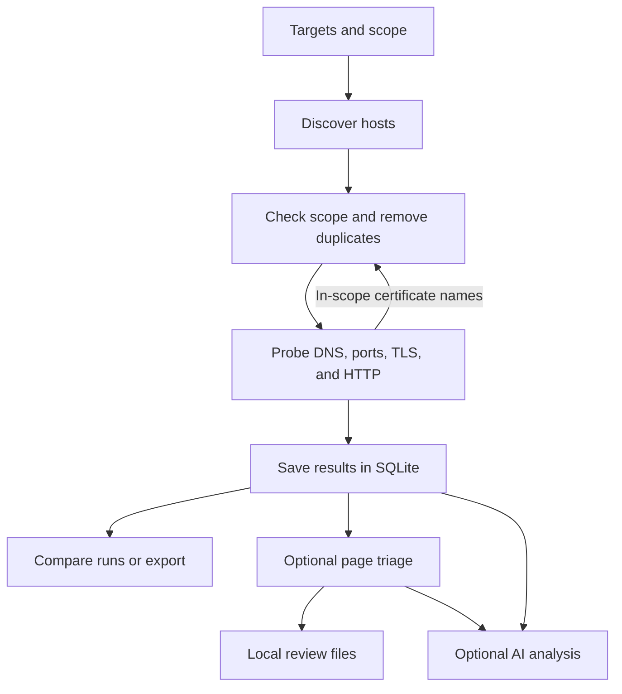

# recon_test 🚀

`recon_test` is a Rust command-line tool for mapping the web attack surface of domains or IPs you are authorized to test. It discovers in-scope hosts, checks DNS and web services, and saves scan history in SQLite. You can compare runs or create a small local review queue with optional triage.

## Quick start

Install Rust and Cargo, then build the project:

```bash
git clone https://github.com/sssec81/recon_test.git
cd recon_test
cargo build --release
```

Run a first scan without the optional crt.sh lookup:

```bash
cargo run --release -- --target example.com --scope example.com --passive false
```

Results go to `recon_data.db` in the current directory. Use `--db` to choose another path. Only scan hosts you have permission to test.

## How a scan works



Host discovery uses your targets and, by default, certificate records from crt.sh. The scanner probes ports `80`, `443`, `8000`, `8080`, and `8443`. It follows HTTP redirects only within scope. A failed crt.sh request fails the scan; use `--passive false` when you want to skip crt.sh.

A domain scope includes that domain and its subdomains. An IP scope includes only that IP. With `--file`, set `--scope` to the authorized root domain if you want discoveries across that root; otherwise each file entry becomes a scope root.

Choose a web probe mode with `--scheme-strategy`:

- `https-first` (default): try HTTPS, then HTTP if HTTPS fails. When web ports are detected, probe each detected endpoint.
- `https-only`: skip plain HTTP.
- `both-parallel`: try both schemes together when no web port is detected; also try both on alternate web ports.

The scanner tries the selected scheme even if the port check missed it. Failed web requests are saved without a status code.

## Code layout

| Path | Purpose |
| --- | --- |
| `src/main.rs`, `src/cli.rs` | Start the CLI and read targets |
| `src/scan/`, `src/probes/` | Enforce scope, schedule work, and probe hosts |
| `src/storage/` | Save observations in SQLite |
| `src/report/` | Compare scans, export data, and request optional AI analysis |
| `src/triage/` | Crawl pages and build local review files |

## CLI Options & Usage Examples

| Flag | Description | Default |
| --- | --- | --- |
| `-t, --target <TARGET>` | Single target domain or IP (required unless `--file` is used) | None |
| `-s, --scope <SCOPE>...` | Authorized root scope domain(s) | Target input domain |
| `-f, --file <PATH>` | File containing target subdomains (one per line) | None |
| `-c, --concurrency <N>` | Maximum concurrent scan tasks | `20` |
| `--max-targets <N>` | Maximum distinct hosts scheduled; the scan fails if discovery exceeds this limit | `10000` |
| `--passive [true\|false]` | Ingest passive Certificate Transparency logs via crt.sh | `true` |
| `--scheme-strategy <STRATEGY>` | Probing scheme (`https-first`, `https-only`, `both-parallel`) | `https-first` |
| `--diff-last` | Diff against the previous compatible finished run | `false` |
| `--diff <UUID_A> <UUID_B>` | Compare specific historical scan runs | None |
| `--llm-analyze` | Enable optional AI analysis; with `--triage`, analyze verified review candidates only | `false` |
| `--ollama-model <MODEL>` | Local Ollama model name | `llama3:8b` |
| `--ollama-url <URL>` | Local Ollama API endpoint | `http://localhost:11434` |
| `--llm-backend <BACKEND>` | AI backend (`ollama` or `anthropic`) | `ollama` |
| `--anthropic-api-key <KEY>` | Anthropic API key (or use `ANTHROPIC_API_KEY`) | None |
| `--anthropic-model <MODEL>` | Anthropic model name | `claude-3-5-haiku-20241022` |
| `--llm-max-tokens <N>` | Maximum AI response tokens | `1024` |
| `--triage` | Run bounded evidence triage after recon | `false` |
| `--triage-max-pages <N>` | Maximum pages or scripts fetched in triage | `250` |
| `--triage-max-depth <N>` | Maximum crawl depth from discovered endpoints | `2` |
| `--triage-max-requests <N>` | Total triage request budget, including checks | `1000` |
| `--triage-max-minutes <N>` | Triage phase time limit in minutes | `240` |
| `--triage-max-findings <N>` | Maximum review queue entries | `5` |
| `--triage-delay-ms <N>` | Delay between triage requests | `200` |
| `--triage-dir <PATH>` | Local review and evidence directory | `triage_output` |
| `--export-json <PATH>` | Export scan observations to JSON file | None |
| `--export-csv <PATH>` | Export scan observations to CSV file | None |
| `--export-diff-json <PATH>` | Export scan diff results to JSON file | None |
| `--db <PATH>` | SQLite database file | `recon_data.db` |

`--target` takes precedence if both `--target` and `--file` are supplied. `--diff` still performs a new scan before comparing the two requested historical IDs. JSON and CSV exports contain this run's HTTP observations; they are not complete exports of every database table.

### Scan single target with active scope and passive CT logs:
```bash
cargo run -- -t example.com --scope example.com --passive true
```

### Run scan with automatic local AI attack surface analysis (Ollama):
```bash
cargo run -- -t example.com --scope example.com --llm-analyze
```

For Anthropic analysis, set `ANTHROPIC_API_KEY` and add `--llm-backend anthropic`.

### Build a local review queue

```bash
cargo run --release -- -t example.com --scope example.com --passive false --triage
```

Triage starts after recon. Its time and request limits apply to the triage phase only. It follows in-scope GET links and scripts, skips common state-changing paths, and does not submit forms. Output is saved under `triage_output/<scan-id>/review.md`, `review.json`, `endpoints.json`, `anomalies.json`, `suppressed.json`, and `evidence/`. The endpoint inventory records route templates, query and form field names, discovery sources, observed statuses, and content types. `suppressed.json` records candidates rejected by repeat or control checks, budget limits, and the review queue cap. Review packages contain response metadata, a short text excerpt, and a body hash. They do not contain full response bodies. Treat local evidence as potentially sensitive.

Triage also rechecks initial web endpoints that returned a server error, so a detailed error page at the scan entry point can enter the review queue.

Triage recognizes directory indexes, detailed server errors, and object identifiers in URLs. It also compares responses from the same route and parameter set; a stable 5xx response against a stable successful control can become a review candidate. Each candidate must survive repeat checks for status, content type, response size, and final URL. Directory and server-error checks use two control requests; response anomalies alternate baseline and control requests to catch drift. Object-ID pages are repeated, but ownership and authorization still require two authorized test accounts. `Confirmed` is reserved for manual validation.

Add `--llm-analyze` to a triage run to request one optional AI review of up to five verified findings. The model receives only finding IDs, categories, sanitized route paths, query parameter names, status and content type, and repeat/control counts. Full URLs, query values, response bodies, titles, hashes, and headers are not sent. AI suggestions are saved in `ai_triage.json` and `ai_triage.md`; they cannot change scanner confidence, add findings, or trigger HTTP checks. Ollama is the default local backend. Use `--llm-backend anthropic` and `ANTHROPIC_API_KEY` for cloud analysis. If AI fails, the deterministic review queue remains available.

### Rescan, auto-diff against previous run, and generate AI diff analysis:
```bash
cargo run -- -t example.com --diff-last --llm-analyze
```

## Database migration

Existing databases remain usable. Older service and TLS rows stay in their legacy tables because they did not contain a scan ID; new observations use scan-specific tables. Re-scan a target to build comparable service and TLS history.

Passive discovery errors now fail the run instead of producing an incomplete successful scan. Use `--passive false` when crt.sh is unavailable.

## Verification and limitations

Run `cargo test --all-targets` for the local test suite. It uses loopback HTTP servers and an in-memory SQLite database; it does not scan public targets. Run `cargo fmt --check` to check formatting.

This is reconnaissance and review assistance, not a vulnerability verdict. Triage uses GET requests, skips common action paths and sensitive query names, and limits page bytes, time, requests, and review entries. A GET endpoint can still have side effects, so set limits appropriate to the target. Review candidates require manual validation, especially object ownership and authorization. TLS certificate validation is relaxed for target probes to collect metadata from staging or misconfigured endpoints; crt.sh and AI API requests use normal certificate validation. Scan comparison requires two completed runs with comparable scope and settings. Optional AI output is advisory and does not change deterministic triage findings.

## License
MIT
